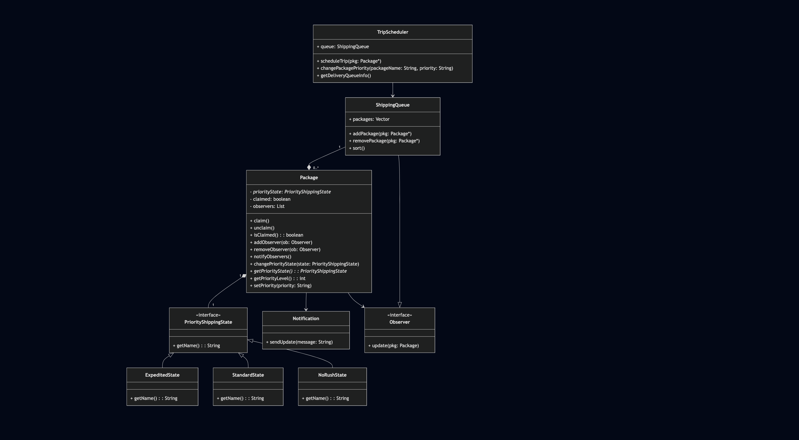

Writing
- File Name: README.md (should be located in the GitHub repository)
- Team number, member names, and x500s.
- Overview: This should be an overview of the whole project, not just your
extension
- Instructions: This section should include build and run commands as well as
instructions on how to use the front end. If your extension drastically changes the
way that the user interacts with the simulation, we need to know this.
- Requirements: This section should have a complete list of EARS style
requirements for only your new features.
- Design: This section should explain how your extension adds to existing features
using design patterns and why you chose those design patterns for the design.
- Sprint retrospective: This section should have your sprint retrospective which we
expect you to write when you finish the project. A sprint retrospective is stating
what went well, what didn’t go well, and what to do next time to mitigate what
didn’t go well.
- Jira Board: Please include a screenshot of your completed sprint board as well.
- UML
- Create a UML diagram depicting ONLY your new feature(s)
- Upload this to the GitHub repo and also display this in the aforementioned
README file
- The person who will be reading your UML is assumed to be fluent in the code
base, so you can omit classes that are irrelevant to your feature(s).

Team Number: 30

Names: Xander Hill, 

x500s: hill1594, 

Overview: Simulation of package delivery and various entity movement in UMN campus. Entities such as drones, humans, helicopters move around map. Deliveries for packages can be scheduled and drones will pick them up from origin and deliver to target destination.

Instructions: 

    build: make -j

    run: make run

    frontend: Move around and adjust zoom of map by clicking and dragging. Schedule deliveries by clicking two points on map, naming packing, and selecting priority and movement strategies. Add additional drones to pickup more packages. Add other entities as requested. Change package priorities by entering package name (with _package at end) and selecting newly desired priority. Export simulation data to .csv file that will save locally. Adjust simulation speed as desired.

Requirements:

    Priority Queue:

        The drone simulation shall deliver packages in order based on their priority.

        The drone simulation shall track the order of the packages to be delivered.

        The drone simulation shall allow for three levels of shipping priority to be chosen.

        The drone simulation shall allow the shipping priority to be chosen on the control panel through a drop down box.

        The drone simulation shall present the shipping queue in the control panel, which presents the list of packages to be shipped.

        The drone simulation shall display the shipping status and delivery status of each package.

        The drone simulation shall require shipping priority selected when scheduling a package.

        The drone simulation shall order the packages in the queue with Expedited packages first, standard packages second, and No Rush packages last.

        WHEN a package is scheduled to be delivered, the drone simulation shall be entered into the queue based on the priority selected.

        WHEN a package is delivered, the next package in the queue shall be selected for delivery.

        WHEN a package is picked up for delivery, the drone simulation shall not allow any further changes to the shipping priority.

        WHEN a package has been delivered, it shall be removed from the shipping queue.

        WHILE a package hasn’t been claimed for delivery, the drone simulation shall allow changing of priority shipping.

        IF a package’s shipping status changes, the drone simulation shall add the package to the bottom of the selected shipping priority queue.

        IF a package has their shipping status changed, the drone simulation shall send out a notification.

        IF a user attempts to change the shipping status when the package has already been sent for delivery, the drone simulation shall display an error message.

Design:

    Priority Queue: Adds to delivery features through State design pattern, allowing for each package in delivery queue to have a shipping priority state and queue to be organized by these priorities. State design chosen for this feature because state pattern allows packages to alter their behavior (delivery order) after the internal state changes (shipping priority). Allows seamless switching of shipping priority prior to delivery logic starting (for complexity purposes drones commit to a package and cannot switch between packages prior to pick up).

Sprint Retrospective:
    
    What went well:

        Good communication on heavy work days where lot of progress needed i.e. integration between features, deadlines for steps.

        Good documentation and laying out of requirements, UML, test cases, etc.
        
        Consistent code style/structure.

        Members consistently asked for help with features/integration when needed.

        Good use of version control to manage individual features before merging using branch structures.

    What didn't go well:

        Significant work done too close to deadlines, additional stress/scrambling.

        Communication prior to merging, incoming conflicts.

        Underdeveloped CI/CD process.

        Testing not thorough/consistent.

    What to do next time:

        Start every step of process earlier.

        Clearer and committed deadlines.

        Maintain consistent CI/CD process, set up tests for application to pass on merges.

        Set up more tests, and make sure tests are more clearly defined (i.e. specific edge cases).

        Better understand code given before beginning work.

Jira Board:

